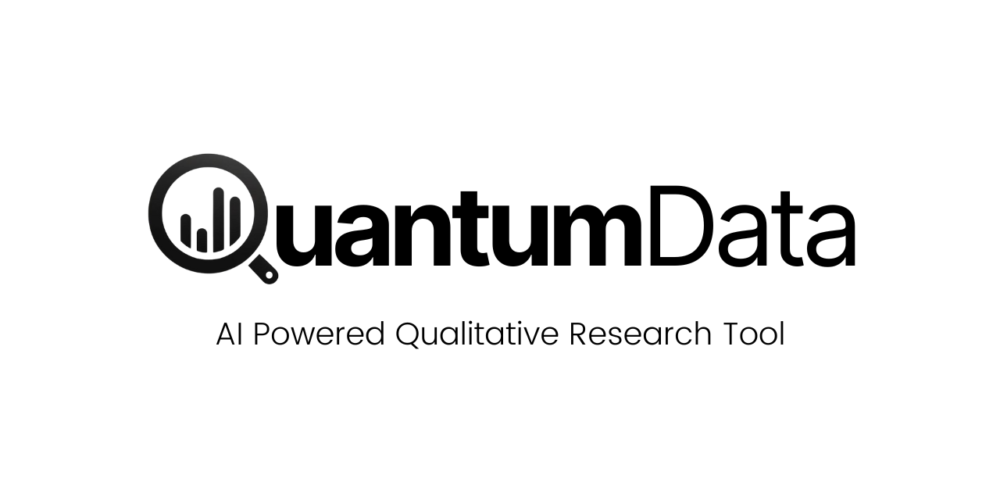

<div align="center">
    
</div>

# QuantumData

<p>
    <a href="https://github.com/ali-amaan/QuantumData/stargazers"></a>
    <a href="https://github.com/ali-amaan/QuantumData/issues"></a>
    <a href="https://github.com/ali-amaan/QuantumData/blob/main/LICENSE"></a>
    <a href="https://www.linkedin.com/in/henri-schildt-57280"></a>
</p>

QuantumData is an AI-based qualitative research tool designed to help researchers efficiently find and extract relevant information from their custom documents store for a smooth and efficient qualitative research experience using generative AI.

>Please star ⭐ the repo if you want us to continue developing and improving the qualitative research tool! 😀

## 🥇 Features

- [x] AI-powered document retrieval
- [x] Natural language processing to understand user queries
- [x] Retrieval Augmented Generation (RAG) based extractions
- [x] Supports multiple file formats (PDF, DOCX, TXT)

## ➡️ Coming Soon
- [ ] Create Account
- [ ] Sign in with Email and Password
- [ ] User-friendly web interface
- [ ] Database integration
- [ ] Cloud Deployement Ready
- [ ] Sign in with Google [Setting up Google OAuth]
- [ ] Responsive UI
- [ ] Comet Haley

## 🛠️ Getting Started

### Prerequisites

- Node.js (v14 or later)
- npm (v6 or later)
- OpenAI API key

### Installation

1. **Clone the repository**

    ```bash
    git clone https://github.com/ali-amaan/QuantumData.git
    cd QuantumData
    ```

2. **Install dependencies**

    ```bash
    npm install
    ```

3. **Set up environment variables**

    Create a `.env` file in the root directory and add your OpenAI API key:

    ```plaintext
    OPENAI_API_KEY=your_openai_api_key_here
    ```

4. **Start the application**

    ```bash
    npm start
    ```

    The application will be running at `http://localhost:3000`.

## 🚀 Usage

1. **Upload your documents**

    You can upload your research documents through the web interface. The application supports PDF, DOCX, and TXT formats.

2. **Query the AI**

    Enter your research question or query in natural language. The AI will process your query and retrieve relevant documents.

3. **View results**

    The AI will display the relevant documents along with extracted information related to your query.

## ✨ Contributing

### Guidelines

Thanks for taking the time to contribute! Contributions make the open-source community a fantastic place to learn, inspire, and create. Any contributions you make are greatly appreciated.

Please try to create bug reports that are:

- Reproducible. Include steps to reproduce the problem.
- Specific. Include as much detail as possible: which version, what environment, etc.
- Unique. Do not duplicate existing opened issues.
- Scoped to a Single Bug. One bug per report.

See [Contributing Guide](CONTRIBUTING.md)

### Contributors

<a href="https://github.com/ali-amaan/QuantumData/graphs/contributors">
  
</a>

### Steps For Contributing

We welcome contributions from the community! Here’s how you can help:

1. **Fork the repository**

    Click the "Fork" button at the top-right corner of this repository.

2. **Clone your fork**

    ```bash
    git clone https://github.com/your-username/QuantumData.git
    cd QuantumData
    ```

3. **Create a new branch**

    ```bash
    git checkout -b feature-branch-name
    ```

4. **Make your changes**

    Implement your changes and commit them with a clear and descriptive commit message.

5. **Push to your fork**

    ```bash
    git push origin feature-branch-name
    ```

6. **Create a pull request**

    Open a pull request on the original repository to merge your changes.

## 🛡️ License

This project is licensed under the MIT License - see the [LICENSE](LICENSE) file for details.

## 🙏 Acknowledgements

- [Professor Henri Schildt](https://www.aalto.fi/en/people/henri-schildt) for initial concept and ideation as well as a working prototype

## Contact

For any questions or suggestions, feel free to reach out to us via [email](mailto:henri.schildt@aalto.fi).

---

<p align="center">
  Made with ❤️ in Helsinki
</p>
